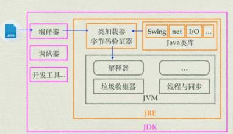
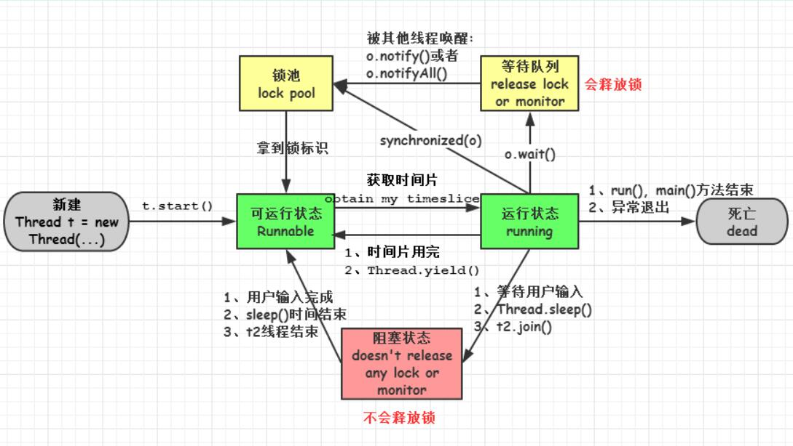
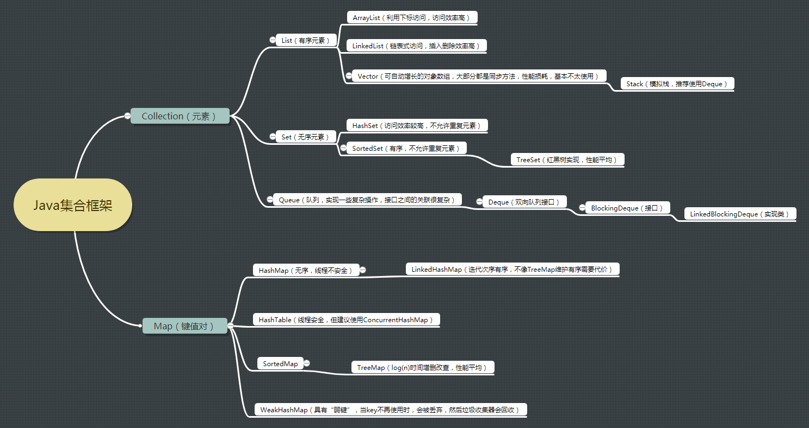
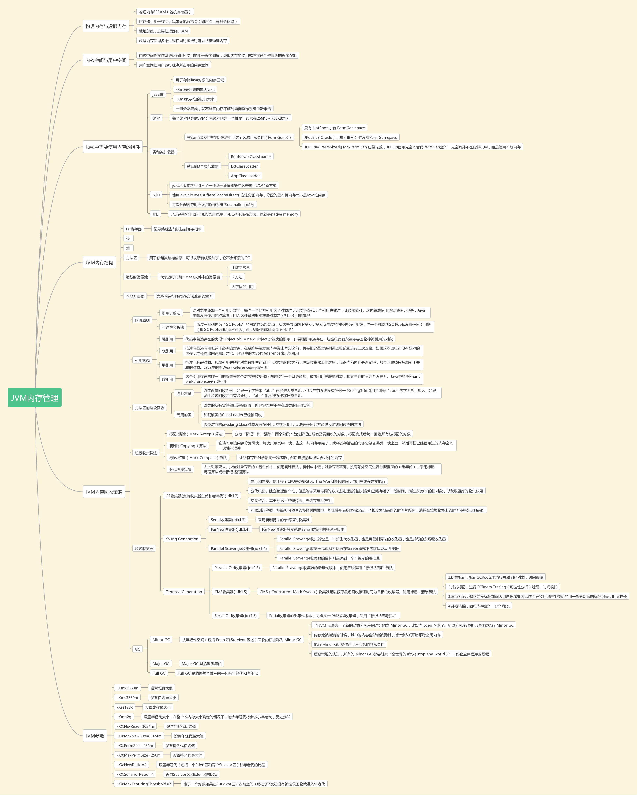
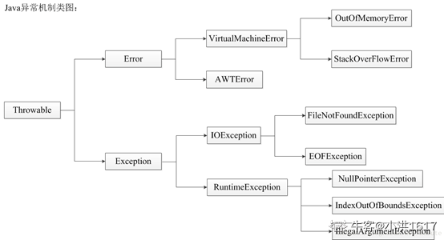
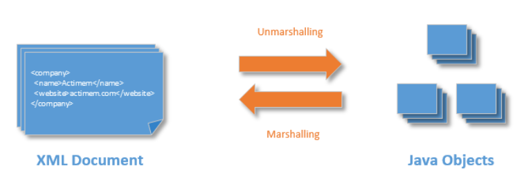
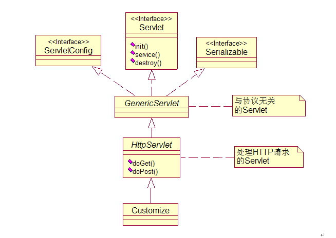
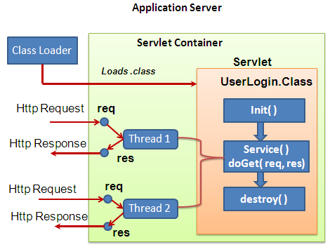

####  JAVA基础知识问答
1.  **什么是Java虚拟机？为什么Java被称作是“平台无关的编程语言”？**
	* Java虚拟机是一个可以执行Java字节码的虚拟机进程。Java源文件被编译成能被Java虚拟机执行的字节码文件。也就是class文件
	* Java被设计成允许应用程序可以运行在任意的平台，而不需要程序员为每一个平台单独重写或者是重新编译。Java虚拟机让这个变为可能，因为它知道底层硬件平台的指令长度和其他特性。java源程序先通过javac编译成二进制class文件，class文件运行在jvm上，根据不同的机器硬件，jvm将同样的class文件转换成对应硬件的机器码。

2.  **JDK和JRE的区别是什么？**
	* JRE(Java Runtime Environment)  java运行时环境，包含了java虚拟机，java基础类库，是使用java语言编写的程序运行所需要的软件环境，是提供给想运行java程序的用户使用的。
	* JDK(Java Development Kit) java开发工具包，包含了JRE，以及编译器javac，调试工具等，提供给程序员使用

	
3. **static关键字是什么意思？Java中是否可以覆盖(override)一个private或者是static的方法？** 
	* static 是静态的意思，表示该方法的调用不需要通过类的实例来使用
	* Java中static方法不能被覆盖。因为方法覆盖是基于运行时动态绑定的，而static方法是编译时静态绑定的。static方法跟类的任何实例都不相关，所以概念上不适用。
	* java中也不可以覆盖private的方法，因为private修饰的变量和方法只能在当前类中使用，如果是其他的类继承当前类是不能访问到private变量或方法的，当然也不能覆盖。

4. **是否可以在static环境中访问非static变量？** 
	* 可以访问，但是不可以直接访问。需要有类的实例来访问。static变量属于类，随着类的加载而加载到静态方法区内存。当类加载时，此时不一定有实例创建，没有实例，就不可以访问非静态的成员。

5. **什么是自动拆装箱？**
	* Java支持的数据类型包括两种 一种是基本数据类型：byte short int long float double char boolean 另一种是引用数据类型，如String等，其实是对象的引用，JVM中虚拟栈中存的是对象的地址，创建的对象实质在堆中，通过地址来找到堆中的对象的过程，即为引用类型。自动装箱就是Java编译器在基本数据类型和对应的对象包装类型间的转化，即int转化为Integer,自动拆箱是Integer调用其方法将其转化为int的过程
	* 常量池的关系，在创建一个-128～127之间的Integer时，它不会创建新对象
	
6. **重载和重写注意点**
	* 被重写的方法不能为static。如果父类中的方法为静态的，而子类中的方法不是静态的，但是两个方法除了这一点外其他都满足重写条件，那么会发生编译错误（即静态方法不能被重写）；反之亦然。即使父类和子类中的方法都是静态的，并且满足重写条件，但是仍然不会发生重写，因为静态方法是在编译的时候把静态方法和类的引用类型进行匹配（Father a=new Son（）；若Father有个静态方法f（），其子类Son也有个相同静态方法f（），那么a.f（）是调用的Father的f（），也就是说引用a和Father的静态方法匹配）。

7. **什么是复制构造方法？**
	* 复制构造方法是c++里的概念，java里不存在复制构造方法。复制构造函数就是将本类的对象作为参数的构造函数，目的是用一个已经实例化的对象来初始化另一个对象，简单点说就是拷贝一个对象。Java并不支持这样的复制构造函数。但是这并不代表Java中没有这种机制，在Java中Object类的clone()方法就是这种机制的体现。

8. **接口和抽象类的区别是什么？**
	* 从设计层面来说，抽象是对类的抽象，是一种模板设计，接口是行为的抽象，是一种行为的规范。
	* 接口中所有的方法隐含的都是抽象的，抽象类中可以有非抽象方法
	* 类可以不实现抽象类和接口声明的所有方法，当然，在这种情况下，类也必须得声明成是抽象的。
	* Java接口中声明的变量默认都是final的。抽象类可以包含非final的变量。
	* Java接口中的成员函数默认是public的。抽象类的成员函数可以是private，protected或者是public。
	* 接口不能用new实例化，但可以声明，但是必须引用一个实现该接口的对象
	* java8后 接口中用default修饰的方法可以有函数体（可以实现）

9.  **进程和线程的区别是什么？**
	* 进程是执行着的应用程序，而线程是进程内部的一个执行序列。一个进程可以有多个线程。线程又叫做轻量级进程。
	* 地址空间和其它资源：进程间相互独立，同一进程的各线程间共享。某进程内的线程在其它进程不可见。
	* .通信：进程间通信IPC，线程间可以直接读写进程数据段（如全局变量）来进行通信——需要进程同步和互斥手段的辅助，以保证数据的一致性。
	* 调度和切换：线程上下文切换比进程上下文切换要快得多。

10. **创建线程有几种不同的方式？**
	* ①继承Thread类（真正意义上的线程类），是Runnable接口的实现。（1）定义Thread类的子类，并重写该类的run方法，该run方法的方法体就代表了线程要完成的任务。因此把run()方法称为执行体。（2）创建Thread子类的实例，即创建了线程对象。（3）调用线程对象的start()方法来启动该线程。
	* ②实现Runnable接口，并重写里面的run方法。（1）定义runnable接口的实现类，并重写该接口的run()方法，该run()方法的方法体同样是该线程的线程执行体。（2）创建 Runnable实现类的实例（注意 ，这里声明的是实现类，构造方法也是实现类的构造方法），并依此实例作为Thread构造方法的参数来创建Thread对象，该Thread对象才是真正的线程对象。（3）调用线程对象的start()方法来启动该线程。
	* ③使用Executor框架创建线程池。Executor框架是juc里提供的线程池的实现。
	* ④实现callable接口，重写call方法，有返回值。
	* 继承于Thread类的线程类，可以直接调用start方法启动线程 ; 实现Runnable接口的类需要再次用Thread类包装后才能调用start方法。
	* Runnable接口有如下好处：①避免点继承的局限，一个类可以继承多个接口。②适合于资源的共享，多个线程可以共享一个runnable对象，所以非常适合多个相同线程来处理同一份资源的情况。但是也有缺点，thread子类获取线程时，用this.即可，而runnable接口则需要Thread.currentThread（）这个静态方法。

11. **Thread的常用方法**
	* start()：启动线程并执行相应的run()方法
	* run():子线程要执行的代码放入run()方法中
	* currentThread()：静态的，调取当前的线程
	* getName():获取此线程的名字
	* setName():设置此线程的名字
	* yield():调用此方法的线程释放当前CPU的执行权（很可能自己再次抢到资源）
	* join():在A线程中调用B线程的join()方法，表示：当执行到此方法，A线程停止执行，直至B线程执行完毕,A线程再接着join()之后的代码执行
	* isAlive():判断当前线程是否还存活
	* sleep(long l):显式的让当前线程睡眠l毫秒  (只能捕获异常，因为父类run方法没有抛异常)
	* getPriority()：返回线程优先值
	* setPriority(int newPriority)：改变线程的优先级（非绝对，只是相对几率大些）
	* wait():当一个线程调用了object.wait()，那么它就会进入object对象的等待队列。这个等待队列中，可能会有多个线程，因为系统运行多个线程同时等待某一个对象。
	* notify():当object对象调用了obj.notify()方法，就会从这个等待队列，随机选择一个线程将其唤醒。这里的选择是不公平的完全是随机的。
	* notifyAll()：它与notify()方法的功能基本一致，不同的是它在唤醒这个等待队列中的所有等待线程而不是随机选择一个

12. **解释下线程的几种可用状态。**
	* new 新建一个线程对象
	* runnable 线程对象创建后，调用start方法。该状态的线程位于可运行线程池中，等待被线程调度选中，从而获得cpu的使用权
	* running runnable状态的线程获得了cpu的使用权，执行程序代码
	* block 阻塞状态是指线程因为某些原因放弃了cpu的使用权，暂停运行，直到线程进入可运行( runnable )状态，才有 机会再次获得 cpu timeslice 转到运行( running )状态。阻塞的情况分三种：
		* 等待阻塞：运行( running )的线程执行 o . wait ()方法， JVM 会把该线程放 入等待队列( waitting queue )中。
		* 同步阻塞：运行( running )的线程在获取对象的同步锁时，若该同步锁 被别的线程占用，则 JVM 会把该线程放入锁池( lock pool )中。
		* 其他阻塞: 运行( running )的线程执行 Thread . sleep ( long ms )或 t . join ()方法，或者发出了 I / O 请求时， JVM 会把该线程置为阻塞状态。当 sleep ()状态超时、 join ()等待线程终止或者超时、或者 I / O 处理完毕时，线程重新转入可运行( runnable )状态。
	*  死亡( dead )：线程 run ()、 main () 方法执行结束，或者因异常退出了 run ()方法，则该线程结束生命周期。死亡的线程不可再次复生。 


13. **同步方法和同步代码块的区别是什么？**
	* 同步方法默认用this或者当前类class对象作为锁；
	* 同步代码块可以选择以什么来加锁，比同步方法要更细颗粒度，我们可以选择只同步会发生同步问题的部分代码而不是整个方法；
	* 同步方法使用关键字 synchronized修饰方法，而同步代码块主要是修饰需要进行同步的代码，用   synchronized（object）{代码内容}进行修饰；

14. **在监视器(Monitor)内部，是如何做线程同步的？程序应该做哪种级别的同步？**
	* 监视器和锁在Java虚拟机中是一块使用的。在 java 虚拟机中, 每个对象( Object 和 class )通过某种逻辑关联监视器,每个监视器和一个对象引用相关联, 为了实现监视器的互斥功能, 每个对象都关联着一把锁.
	* 一旦方法或者代码块被 synchronized 修饰, 那么这个部分就放入了监视器的监视区域, 确保一次只能有一个线程执行该部分的代码, 线程在获取锁之前不允许执行该部分的代码
	*  JVM基于进入和退出Monitor对象来实现方法同步和代码块同步，但两者的实现细节不一样。本质都是对一个对象的监视器（monitor）进行获取，而这个获取过程是排他的，也就是同一时刻只能有一个线程获取到由synchronized所保护对象的监视器

15. **如何确保N个线程可以访问N个资源同时又不导致死锁？**
	* 多线程产生死锁需要四个条件，分别是互斥性，保持和请求，不可剥夺性还有要形成闭环，这四个条件缺一不可，只要破坏了其中一个条件就可以破坏死锁。使用多线程的时候，一种非常简单的避免死锁的方式就是：指定获取锁的顺序，并强制线程按照指定的顺序获取锁。因此，如果所有的线程都是以同样的顺序加锁和释放锁，就不会出现死锁了。

16. **Java集合类框架的基本接口有哪些？**
	* 两大类接口 Collection和Map。Collection下包含List、Set等，ArrayList和 LinkedList 实现了List接口，HashSet实现了Set接口。HashMap 和HashTable实现了Map接口，并且HashTable是线程安全的，但是HashMap性能更好


17. **为什么集合类没有实现Cloneable和Serializable接口？**
	* 克隆(cloning)或者是序列化(serialization)的语义和含义是跟具体的实现相关的。因此，应该由集合类的具体实现来决定如何被克隆或者是序列化。即，集合类框架中的接口没有实现Cloneable和Serializable接口，但是具体的实现类是实现了这些接口的，比如Arraylist
	* 实现Serializable序列化的作用：将对象的状态保存在存储媒体中以便可以在以后重写创建出完全相同的副本

18. **什么是迭代器(Iterator)？**
	* 迭代器是一种设计模式，它是一个对象，它可以遍历并选择序列中的对象，而开发人员不需要了解该序列的底层结构。迭代器通常被称为“轻量级”对象，因为创建它的代价小。
	* Iterator接口提供了很多对集合元素进行迭代的方法。每一个集合类都包含了可以返回迭代器实例的迭代方法。迭代器可以在迭代的过程中删除底层集合的元素,但是不可以直接调用集合的remove(Object Obj)删除，可以通过迭代器的remove()方法删除。

19. **快速失败(fail-fast)和安全失败(fail-safe)的区别是什么？**
	* 快速失败： 在用迭代器遍历一个集合对象时，如果遍历过程中对集合对象的结构（只对值进行修改不会抛出错误）进行了修改（增加、删除），则会抛出Concurrent Modification Exception。在 java.util 包的HashMap、ArrayList 这些集合类都是快速失败的。
		* 原理：迭代器在遍历时直接访问集合中的内容，并且在遍历过程中使用一个 modCount 变量。集合在被遍历期间如果结构发生变化，就会改变modCount的值。每当迭代器使用hashNext()/next()遍历下一个元素之前，都会检测modCount变量是否为expectedmodCount值，是的话就返回遍历；否则抛出异常，终止遍历。
	* 安全失败： 采用安全失败机制的集合容器，在遍历时不是直接在集合内容上访问的，而是先复制原有集合内容，在拷贝的集合上进行遍历。java.util.concurrent 包下的类都是安全失败，比如：ConcurrentHashMap。
		* 原理：由于迭代时是对原集合的拷贝进行遍历，所以在遍历过程中对原集合所作的修改并不能被迭代器检测到，所以不会触发Concurrent Modification Exception。

20. **Java中的HashMap的工作原理是什么？**
	* hashmap是一种键值对的数据结构，jdk1.8后用数组+链表+红黑树的方式实现。hashmap数组的默认初始长度是16，hashmap数组只允许一个key为null，允许多个value为null。
	* 使用链地址法解决hash冲突
	* 1.8前是头插，但是并发场景下扩容1会出现循环链表，所以1.8后改为尾插，同时加入了红黑树，如果链表长度大于某个值（比如8），就转化为红黑树结构。在jdk1.8时，不用重新计算hash，只用看看原来的hash值新增的一位是零还是1，如果是1这个元素在新数组中的位置，是原数组的位置加原数组长度，如果是零就插入到原数组中。
	* 负载因子的初始值为0.75 空间利用率比较高，而且避免了相当多的Hash冲突

21. **HashMap和Hashtable有什么区别？**
	* HashMap允许键和值是null，而Hashtable不允许键或者值是null。
	* Hashtable是同步的，而HashMap不是。因此，HashMap更适合于单线程环境，而Hashtable适合于多线程环境
	* HashMap是非线程安全的，HashTable是线程安全的。
	* 因为线程安全的问题，HashMap效率比HashTable的要高。
	* 一般现在不建议用HashTable, ①是HashTable是遗留类，内部实现很多没优化和冗余。②即使在多线程环境下，现在也有同步的ConcurrentHashMap替代，没有必要因为是多线程而用HashTable。

22. **Comparable和Comparator接口是干什么的？列出它们的区别。**
	* Comparable是修改类内部来定义比较大小的方法。类实现了Comparable接口，然后重写了compareTo方法（这个方法可以看作比较器），这个类就拥有了内部比较器。
	* Comparator是在外部定义比较方法，应用于对象中。新定义一个类，类名随意，但这个类必须实现Comparator接口，重写compare方法，我们把这个称作外部比较器。
	* 使用Comparable方式比较时，我们将比较的规则写入了比较的类型中，其特点是高内聚。但如果哪天这个规则需要修改，那么我们必须修改这个类型的源代码。如果使用Comparator方式比较，那么我们不需要修改比较的类，其特点是易维护，但需要自定义一个比较器，后续比较规则的修改，仅仅是改这个比较器中的代码即可。

23. **Enumeration接口和Iterator接口的区别有哪些？**
	* Enumeration 只有2个函数接口（hasMoreElements()，nextElement()）。 通过Enumeration，我们只能读取集合的数据，而不能对数据进行修改。占用内存少，速度快，但不是线程安全的
	* Iterator 只有3个函数接口（hasNext()，next()，remove()）。 Iterator除了能读取集合的数据之外，也能数据进行删除操作。 Iterator 支持 fail-fast 机制

24. **HashSet、TreeSet、LinkedHashSet对比？**
	* HashSet对速度进行了优化，提供了最快的查找速度，无特殊说明一般默认是用这个Set。放到HashSet中的元素要保证唯一，应该重写hashCode方法和equals方法，但是不能保证元素有序底层实现是哈希结构
	* TreeSet底层实现是红黑树(自平衡二叉树)，不但能保证元素唯一，还能元素保证有序，存放到TreeSet中的元素应该实现Comparable接口，重写compareTo方法，（或者实现comparator）否则会抛出ClassCastException。add()，remove()，contains()方法的时间复杂度是O(logn)。
	* LinkedHashSet，底层实现是哈希表和链表，保持了HashSet的速度，还能按照插入元素的顺序维持元素顺序

25. **finalize()方法什么时候被调用？析构函数(finalization)的目的是什么？**
	* finalize()是Object的protected方法，子类可以覆盖该方法以实现资源清理工作，GC在回收对象之前调用该方法。但是GC本来就是内存回收了，应用还需要在finalization做什么呢？ 答案是大部分时候，什么都不用做(也就是不需要重载)。只有在某些很特殊的情况下，比如你调用了一些native的方法(一般是C写的)，可以要在finaliztion里去调用C的释放函数。
	* 调用时机：当对象变成(GC Roots)不可达时，GC会判断该对象是否覆盖了finalize方法，若未覆盖，则直接将其回收。否则，若对象未执行过finalize方法，将其放入F-Queue队列，由一低优先级线程执行该队列中对象的finalize方法（但不承诺等待其运行结束）。执行finalize方法完毕后，GC会再次判断该对象是否可达，若不可达，则进行回收，否则，对象“复活”。
	* finalization的目的：对象逃脱死亡的最后一次机会。（只要重新与引用链上的任何一个对象建立关联即可。）但是不建议使用，运行代价高昂，不确定性大，且无法保证各个对象的调用顺序。可用try-finally或其他替代。 

26. **如果对象的引用被置为null，垃圾收集器是否会立即释放对象占用的内存？**
	* 不会立即释放对象占用的内存。 如果对象的引用被置为null，只是断开了当前线程栈帧中对该对象的引用关系，而 垃圾收集器是运行在后台的线程，只有当用户线程运行到安全点(safe point)或者安全区域才会扫描对象引用关系，扫描到对象没有被引用则会标记对象，这时候仍然不会立即释放该对象内存，因为有些对象是可恢复的（在 finalize方法中恢复引用 ）。只有确定了对象无法恢复引用的时候才会清除对象内存。

27. **Java堆的结构是什么样子的？什么是堆中的永久代(Perm Gen space)?**
	* 栈：在函数中定义的 一些基本类型的变量和对象的引用变量都是在函数的栈内存中分配 。当在一段代码块中定义一个变量时，java就在栈中为这个变量分配内存空间，当超过变量的作用域后，java会自动释放掉为该变量分配的内存空间，该内存空间可以立刻被另作他用。
	* 堆：Java堆是Java虚拟机所管理的内存中最大的一块。Java堆是被所有线程所共享的一块内存区域，在虚拟机启动时创建。The heap is the runntime data area from which memory for all class instances and arrays is allocated。堆内存用于存放由new创建的对象和数组。在堆中分配的内存，由java虚拟机自动垃圾回收器来管理。在堆中产生了一个数组或者对象后，还可以在栈中定义一个特殊的变量，这个变量的取值等于数组或者对象在堆内存中的首地址，在栈中的这个特殊的变量就变成了数组或者对象的引用变量
	* Java堆虚拟机中的共划分为三个代：年轻代（Young Generation）、年老代（Old Generation）和持久代（Permanent Generation，java8废除）
		* 年轻代  ： 所有新生成的对象首先都是放在年轻代的。年轻代的目标就是尽可能快速的收集掉那些生命周期短的对象。年轻代分三个区。一个Eden区，两个 Survivor区(一般而言)。大部分对象在Eden区中生成。当Eden区满时，还存活的对象将被复制到Survivor区（两个中的一个），当这个 Survivor区满时，此区的存活对象将被复制到另外一个Survivor区，当这个Survivor去也满了的时候，从第一个Survivor区复制过来的并且此时还存活的对象，将被复制“年老区(Tenured)”。需要注意，Survivor的两个区是对称的，没先后关系，所以同一个区中可能同时存在从Eden复制过来对象，和从前一个Survivor复制过来的对象，而复制到年老区的只有从第一个Survivor去过来的对象。而且，Survivor区总有一个是空的。同时，根据程序需要，Survivor区是可以配置为多个的（多于两个），这样可以增加对象在年轻代中的存在时间，减少被放到年老代的可能。 
		* 年老代 ：在年轻代中经历了N次垃圾回收后仍然存活的对象，就会被放到年老代中。因此，可以认为年老代中存放的都是一些生命周期较长的对象。
	* 永久代就是Java内存分配中的一块区域，表示的是持续使用的一些资源信息，比如class名、method等，这块区域里面的内存对GC的影响不大，并不是GC的首要考虑内容。在Java8中移除了永生代，取而代之是元空间(Metaspace)。String直接存放在堆中，类的元数据存储在meta space中，meta space占用外部内存，不占用堆内存。永久代是Hotspot虚拟机特有的概念，是方法区的一种实现，别的JVM没有这个东西.

28. **串行(serial)收集器和吞吐量(throughput)收集器的区别是什么？**
	* Serial 收集器是历史悠久，最基本的收集器。它是一个单线程的收集器（说明：这里的单线程不仅仅是指收集器工作时使用一个CPU或者一条收集线程去收集，并且Serial工作时，必须暂停其他所有的工作线程，也就是“stop the world”，直到垃圾收集完成。）Serial是JVM运行在Client模式默认的新生代收集器。适合于单CPU、客户端级别。
	* 也叫做Parallel Scavenge 收集器，它的目标是达到一个可控制的吞吐量(throughput)，（说明：吞吐量就是CPU用于执行代码的时间和CPU总共消耗时间的比值，即：吞吐量 = 运行代码时间 / (运行代码时间 + 垃圾收集器工作时间)），JVM提供了两个参数以精确的控制吞吐量，-XX:MaxGCPauseMillis 最大收集停顿时间；-XX:GCTimeRatio 垃圾收集时间占总时间的比例。
	* 了解了他们各自的特性，那么他们之间的不同点就显而易见了，Serial收集器工作时 "stop the world",简单而高效。而throughput收集器更关注总体的吞吐量，收集效果和性能总是密切关联的。适合中等和大规模的应用程序。

29. **JVM的永久代中会发生垃圾回收么？**
	* 永生代也是可以回收的，条件是 :
		* 该类的实例都被回收。 
		* 加载该类的classLoader已经被回收 
		* 该类不能通过反射访问到其方法，而且该类的java.lang.class没有被引用 
	* 当满足这3个条件时，是可以回收，但回不回收还得看jvm。


30. **Java中的两种异常类型是什么？他们有什么区别？**
	* Throwable包含了错误(Error)和异常(Excetion两类).Exception又包含了运行时异常(RuntimeException, 又叫非检查异常)和非运行时异常(又叫检查异常)。非检查异常包括RuntimeException及其子类，一般都是由于程序的逻辑错误引起的，在编码的时候就可以避免，因此没必要进行检查。其他异常都属于检查异常。


31. **Java中Exception和Error有什么区别？**
	*	Error类一般是指与虚拟机相关的问题，如系统崩溃，虚拟机错误，内存空间不足，方法调用栈溢等。对于这类错误的导致的应用程序中断，仅靠程序本身无法恢复和和预防，遇到这样的错误，建议让程序终止。
	*	Exception类表示程序可以处理的异常，可以捕获且可能恢复。遇到这类异常，应该尽可能处理异常，使程序恢复运行，而不应该随意终止异常。	

32. **throw和throws有什么区别？**
	* Throw用于方法内部，Throws用于方法声明上
	* Throw后跟异常对象，Throws后跟异常类型
	* Throw后只能跟一个异常对象，Throws后可以一次声明多种异常类型

33. **final、finally、finalize()方法有什么区别？**
	* final是关键字，final可以修饰类、方法、属性。
		* 如果一个类被final修饰，那么这个类就是最终类，不能派生出新的子类，不能作为父类被继承，该类中的所有方法都不能被重写，但是final类中的成员变量是可以改变的，要想final类中的成员变量的不可以改变，必须给成员变量添加final修饰。因此，一个类不能同时被final和abstract修饰，这两个关键字相互矛盾。
		* 如果final修饰方法，那么这个方法是最终方法，不允许任何子类重写该方法，但子类仍可以使用该方法，注意：final参数用来表示这个参数在这个函数内部不允许被修改。
		* final修饰属性，被final修饰的变量不可变。这里的不可变有两重含义：引用不可变和对象不可变。final指的是引用不可变，即它只能指向初始化时指向的那个对象，而不关心指向对象内容的变化。因此，被final修饰的变量必须初始化，该变量其实就是常量。
	* finally作为异常处理的一部分，只能用在try/catch语句快中，finally代码块中的语句一定会被执行，经常被用来释放资源，如IO流和数据库资源的释放。
	* finalize是Object类的一个方法。在垃圾回收器执行时会调用被回收对象的finalize()方法，可以覆盖此方法来实现对其资源的回收。注意：一旦垃圾回收器准备释放某个对象占用的空间，将首先调该对象的finalize()方法，并且在下一次垃圾回收动作发生时，才真正将该对象占用的内存回收。

34. **什么是JDBC？**
	* JDBC（Java DataBase Connectivity）,是一套面向对象的应用程序接口（API），制定了统一的访问各类关系数据库的标准接口，为各个数据库厂商提供了标准的实现。通过JDBC技术，开发人员可以用纯Java语言和标准的SQL语句编写完整的数据库应用程序，并且真正地实现了软件的跨平台性。JDBC是允许用户在不同数据库之间做选择的一个抽象层，允许开发者用JAVA写数据库应用程序，而不需要关心底层特定数据库的细节。
	* 通常情况下使用JDBC完成以下操作：
		* 同数据库建立连接；
		* 向数据库发送SQL语句；
		* 处理从数据库返回的结果；
	* JDBC具有下列优点：
		* JDBC与ODBC(Open Database Connectivity，即开放数据库互连）十分相似，便于软件开发人员理解；
		* JDBC使软件开发人员从复杂的驱动程序编写工作中解脱出来，可以完全专注于业务逻辑开发；
		* JDBC支持多种关系型数据库，大大增加了软件的可移植性；
		* .JDBC API是面向对象的，软件开发人员可以将常用的方法进行二次封装，从而提高代码的重用性；

35. **解释下驱动(Driver)在JDBC中的角色。**
	* 简单来说 JDBC是一套接口， 驱动是具体实现。JDBC驱动提供了特定厂商对JDBC API接口类的实现，驱动必须要提供java.sql包下面这些类的实现：Connection, Statement, PreparedStatement,CallableStatement, ResultSet和Driver。
	* 在使用jdbc前，应该保证相应的Driver类已经被加载到jvm中，并且完成了类的初始化工作就行了

36. **Class.forName()方法有什么作用？**
	* 在初始化一个类，生成一个实例的时候，newInstance()方法和new关键字除了一个是方法，一个是关键字外，它们的区别在于创建对象的方式不一样，前者是使用类加载机制，后者是创建一个新类。 从JVM的角度看，我们使用关键字new创建一个类的时候，这个类可以没有被加载过。但是使用newInstance()方法的时候，就必须保证： 1、这个类已经加载； 2、这个类已经连接了。 而完成上面两个步骤的正是Class的静态方法forName()所完成的，这个静态方法调用了启动类加载器，即加载 java API的那个加载器，初始化参数指定的类，并且返回此类对应的Class 对象。

37. **PreparedStatement比Statement有什么优势？**
	* 采用预编译，减少编译的时间，运行速度更快，PreparedStatement继承与Statement，并封锁的excute等方法的参数，某种程度上的确防止了SQL注入，提高了安全性。
	* 预编译是简单的文本替换，这样可以避免不良用户直接敲sql语句造成sql注入攻击，利用预编译可以用变量代替值，sql语句不变，只是变量值变了

38. **数据库连接池是什么意思？**
	* 数据库连接的建立、关闭资源消耗巨大。 传统数据库访问方式：一次数据访问对应一个物理连接，每次操作数据库都要打开关闭该物理连接，系统性能严重受损。 解决方案：数据库连接池。系统初始运行时，主动建立足够足够的连接，组成一个池，每次应用程序请求数据库连接时，无需重新打开连接，而是从池中取出已有的连接，使用完后，不再关闭，而是归还。

39. **什么是RMI？**
	* RMI:远程方法调用(Remote Method Invocation)。能够让在某个java虚拟机上的对象像调用本地对象一样调用另一个java 虚拟机中的对象上的方法。
	* https://blog.csdn.net/a19881029/article/details/9465663
	* http://blog.sina.com.cn/s/blog_492dbb6b0100faot.html

40. **RMI体系结构的基本原则是什么？**
	* RMI体系结构是基于一个非常重要的行为定义和行为实现相分离的原则。RMI允许定义行为的代码和实现行为的代码相分离，并且运行在不同的JVM上。对象的使用和对象的创建相分离，我们在服务器端定义类，定义开放哪些方法，并创建对象；在客户端调用对象的方法。

41. **RMI体系结构分哪几层？**
	* 存根和骨架层(Stub and Skeleton layer)：这一层对程序员是透明的，它主要负责拦截客户端发出的方法调用请求，然后把请求重定向给远程的RMI服务。
	* 远程引用层(Remote Reference Layer)：RMI体系结构的第二层用来解析客户端对服务端远程对象的引用。这一层解析并管理客户端对服务端远程对象的引用。连接是点到点的。
	* 传输层(Transport layer)：这一层负责连接参与服务的两个JVM。这一层是建立在网络上机器间的TCP/IP连接之上的。它提供了基本的连接服务，还有一些防火墙穿透策略。


42. **RMI中的远程接口(Remote Interface)扮演了什么样的角色？**
	* 远程接口用来标识哪些方法是可以被非本地虚拟机调用的接口。远程对象必须要直接或者是间接实现远程接口。实现了远程接口的类应该声明被实现的远程接口，给每一个远程对象定义构造函数，给所有远程接口的方法提供实现。

43. **java.rmi.Naming类扮演了什么样的角色？**
	* java.rmi.Naming类用来存储和获取在远程对象注册表里面的远程对象的引用。Naming类的每一个方法接收一个URL格式的String对象作为它的参数。
	* 比如： MyRemoteImpl my = (MyRemoteImpl)Naming.lookup("rmi://xxx.xxx.xx.xx/myExample");
	
44. **RMI的绑定(Binding)是什么意思？Naming类的bind()和rebind()方法有什么区别？**
	* RMI的绑定就是将一个对象赋给一个URI,让客户端可以通过这个URI访问该对象.
	* bind()方法负责把指定名称绑定给远程对象，rebind()方法负责把指定名称重新绑定到一个新的远程对象。如果那个名称已经绑定过了，先前的绑定会被替换掉。

45. **什么是分布式垃圾回收(DGC)？它是如何工作的？**
	* DGC叫做分布式垃圾回收。RMI使用DGC来做自动垃圾回收。因为RMI包含了跨虚拟机的远程对象的引用，垃圾回收是很困难的。DGC使用引用计数算法来给远程对象提供自动内存管理。
	* 当客户机创建（序列化）远程引用时，会在服务器端 DGC 上调用 dirty()。当客户机完成远程引用后，它会调用对应的 clean() 方法。针对远程对象的引用由持有该引用的客户机租用一段时间。租期从收到 dirty() 调用开始。在此类租约到期之前，客户机必须通过对远程引用额外调用 dirty() 来更新租约。如果客户机不在租约到期前进行续签，那么分布式垃圾收集器会假设客户机不再引用远程对象。

46. **解释下Serialization和Deserialization。解释下Marshalling和demarshalling。**
	* 序列化，实现序列化和反序列化的对象必须实现serializable接口，序列化是将对象变成字节流，存储到磁盘或网络。反序列化是序列化的反过程。
	* 当应用程序希望把内存对象跨网络传递到另一台主机或者是持久化到存储的时候，就必须要把对象在内存里面的表示转化成合适的格式。这个过程就叫做Marshalling，反之就是demarshalling。比如：


47. **什么是Servlet？Servlet体系结构？**
	* Servlet是用来处理客户端请求并产生动态网页内容的Java类。Servlet主要是用来处理或者是存储HTML表单提交的数据，产生动态内容，在无状态的HTTP协议下管理状态信息。
	* 所有的Servlet都必须要实现的核心的接口是javax.servlet.Servlet。每一个Servlet都必须要直接或者是间接实现这个接口，或者是继承javax.servlet.GenericServlet或者javax.servlet.http.HTTPServlet。最后，Servlet使用多线程可以并行的为多个请求服务。
	* Servlet类包含所需的三个必要的生命周期方法：init()初试化Servlet、service()相应Servlet请求、destroy()销毁Servlet，但直接继承需要重写所有方法，所以GenericServlet类继承了Servlet类并实现了所有方法，但它不是HTTP协议类，所以又由HttpServlet类继承GenericServlet类并是HTTP协议类。所以我们在建立Servlet类时只需继承HttpServlet类，重写我们需要的doGet()，doPost()请求即可，这两个方法对应客户端的get和post请求。
	* https://blog.csdn.net/a236209186/article/details/51262646


48. **GenericServlet和HttpServlet有什么区别？**
	* GenericServlet  是 Servlet 接口和 ServletConfig 接口的实现类. 但是一个抽象类. 其中的 service 方法为抽象方法
	* HttpServlet 是GenericServlet的子类，针对于 HTTP 协议所定制. 实际开发中, 直接继承 HttpServlet, 并根据请求方式复写 doXxx() 方法即可.
	* Genericservlet是httpservlet 的父类，提供了service方法，在实现时要实现service方法，httpservlet做了精简，提供了doget dopost 方法，更加适用与http协议，

49. **解释下Servlet的生命周期。**
	* Servlet程序是由WEB服务器调用，web服务器收到客户端的Servlet访问请求后：
①Web服务器首先检查是否已经装载并创建了该Servlet的实例对象。如果是，则直接执行第④步，否则，执行第②步。
②装载并创建该Servlet的一个实例对象。 
③调用Servlet实例对象的init()方法。
④创建一个用于封装HTTP请求消息的HttpServletRequest对象和一个代表HTTP响应消息的HttpServletResponse对象，然后调用Servlet的service()方法并将请求和响应对象作为参数传递进去。
⑤WEB应用程序被停止或重新启动之前，Servlet引擎将卸载Servlet，并在卸载之前调用Servlet的destroy()方法。


50. **doGet()方法和doPost()方法有什么区别？**
	* doGet：处理GET请求 doPost：处理POST请求。当发出客户端请求的时候，调用service方法并传递一个请求和响应对象。Servlet首先判断该请求是GET操作还是POST 操作。然后它调用下面的一个方法：doGet 或 doPost。如果请求是GET就调用doGet方法，如果请求是POST就调用doPost方法。doGet和doPost都接受请求(HttpServletRequest)和响应(HttpServletResponse)。
	* get是从服务器上获取数据，路径传参。传输的数据量较小，效率高，安全性差
	* post是向服务器传送数据，实体传参。传送的数据量较大，效率第，安全性好
	* 在做数据查询时，建议用Get方式；而在做数据添加、修改或删除时，建议用Post方式；

51. **什么是Web应用程序？**
	* Web应用程序是一种可以通过Web访问的应用程序，基于典型的B/S模式的应用程序，核心是对数据库的相关操作和处理。Web应用程序的一个最大好处是用户很容易访问应用程序。用户只需要有浏览器即可，不需要再安装其他软件。一个Web应用程序是由完成特定任务的各种Web组件（web components)构成的并通过Web将服务展示给外界。在实际应用中，Web应用程序是由多个Servlet、JSP页面、HTML文件以及图像文件等组成。所有这些组件相互协调为用户提供一组完整的服务。
	* 有两种类型的Web应用：面向表现的和面向服务的。面向表现的Web应用程序会产生包含了很多种标记语言和动态内容的交互的web页面作为对请求的响应。而面向服务的Web应用实现了Web服务的端点(endpoint)。一般来说，一个Web应用可以看成是一组安装在服务器URL名称空间的特定子集下面的Servlet的集合。

52. **什么是服务端包含(Server Side Include)？**
	* 服务端包含(SSI)是一种简单的解释型服务端脚本语言，大多数时候仅用在Web上，用servlet标签嵌入进来。SSI是在页面被提供时由服务器端进行运算，以对现有html页面增加动态生成的内容；如果增加的动态内容少，就用SSI，如果整个页面大多数都需要动态加载，则可以使用cgi提供整个页面，或者使用其他的动态技术。
	* 通常SSI可以用来确保网页中的一些通用内容，比如版权信息、联系方式、或导航信息在全站所有网页中保持一致。使用SSI显示这些通用内容还可以减轻网站维护的工作量，因为当需要修改这些通用信息的时候，只需要改一个地方就可以了，而不需要逐个修改每一个网页。

53. **HTTP响应的结构是怎么样的？**
	* HTTP的请求报文的组成：
请求方法 + 请求的资源的URI + 协议版本 + 可选的请求首部字段 + 内容实体。
	* HTTP的响应报文的组成：
协议版本 + 状态码 + 用于解释状态码的原因短语 + 可选的响应首部字段 + 实体主体。
	* https://www.cnblogs.com/yonyong/p/9229297.html

54. **什么是cookie？session和cookie有什么区别？**
	* cookie实际上是一小段的文本信息。客户端请求服务器，如果服务器需要记录该用户的状态，就使用response向客户端浏览器颁发一个cookie。客户端浏览器会把cookie保存起来。当浏览器再次请求该网站时，浏览器就会把请求地址和cookie一同给服务器。服务器检查该cookie，从而判断用户的状态。服务器还可以根据需要修改cookie的内容。 
	* session是另一种记录客户状态的机制。不同的是cookie保存在客户端浏览器中，而session保存在服务器上。客户端浏览器访问服务器的时候，服务器把客户端信息以某种形式记录在服务器上，这就是session。客户端浏览器再次访问时只需要从该session中查找该客户的状态就可以了。 如果说cookie机制是通过检查客户身上的“通信证”，那么session机制就是通过检查服务器上的“客户明细表”来确认客户身份。
	* 如果客户端禁用了cookie，通常有两种方法实现：
		* session而不依赖cookie：URL重写，就是把sessionId直接附加在URL路径的后面。
		* 表单隐藏字段。就是服务器会自动修改表单，添加一个隐藏字段，以便在表单提交时能够把session id传递回服务器。
	* https://www.cnblogs.com/suguangti/p/11043039.html

55. **什么是HTTP隧道？**
	* HTTP隧道是一种利用HTTP或者是HTTPS把多种网络协议封装起来进行通信的技术。因此，HTTP协议扮演了一个打通用于通信的网络协议的管道的包装器的角色。把其他协议的请求掩盖成HTTP的请求就是HTTP隧道。
	* 不大一样的解释 https://blog.csdn.net/weixin_38189842/article/details/81777100

56. **sendRedirect()和forward()方法有什么区别？**
	* sendRedirect()是URL重定向
		* 浏览器地址栏路径发生变化
		* 发送了两次不同的请求.
		* 因为是不同的请求,所以不能共享请求中的数据.
		* 可以跨域访问资源.
		* 不可以访问WEB-INF中的资源.（WEB-INF是Java的WEB应用的安全目录。所谓安全就是客户端无法访问，只有服务端可以访问的目录。如果想在页面中直接访问其中的文件，必须通过web.xml文件对要访问的文件进行相应映射才能访问。）
		* 速度慢
	* forward()是请求转发
		* 浏览器地址栏路径没变
		* 只发送了一次请求.
		* 共享同一个请求.
		* 只能访问当前应用中的资源,不能跨域跳转
		* 可以访问WEB-INF中的资源.
		* 速度快
	* 请求转发和URL重定向的选择?
		* 若需要共享请求中的数据,只能使用请求转发.
		* 若需要访问WEB-INF中的资源,只能使用请求转发.
		* 若需要跨域访问,只能使用URL重定向.
		* 请求转发可能造成表单的重复提交问题.
		* 其他时候,任选.

57. **什么是URL编码和URL解码？**
	* URL编码是负责把URL里面的空格和其他的特殊字符替换成对应的十六进制表示，反之就是解码。
	* https://www.cnblogs.com/jerrysion/p/5522673.html

注意 jsp技术落后了，以下了解一下

58. **什么是JSP页面？**
	* jsp（Java Server Pages）是java开发的专门用于动态显示页面的技术。jsp编译时，会首先编译成servlet文件，然后编译成class文件。包含9大内置对象：response、request、exception、out、application、pagecontext、config、session、page。有四个域对象：request、pagecontext、session、application

59. **JSP请求是如何被处理的？**
	* 客户端通过浏览器发送jsp请求，服务器端接受到请求后，判断是否是第一次请求该页面，或者该页面是否改变，若是，服务器将jsp页面翻译为servlet，jvm将servlet编译为.class文件，字节码文件加载到服务器内存上执行，服务器将处理结果以.html页面的形式返回给客户端，若该页面不是第一次请求，则省略翻译和编译的步骤，直接执行。

60. **JSP有什么优点？**
	* JSP页面是被动态编译成Servlet的，因此，开发者可以很容易的更新展现代码。
	* JSP页面可以被预编译。
	* JSP页面可以很容易的和静态模板结合，包括：HTML或者XML，也可以很容易的和产生动态内容的代码结合起来。
	* 开发者可以提供让页面设计者以类XML格式来访问的自定义的JSP标签库。
	* 开发者可以在组件层做逻辑上的改变，而不需要编辑单独使用了应用层逻辑的页面。


####  JAVA面试问答

0.  **StringBuilder、StringBuffer、String**
	* 运行速度快慢为：StringBuilder > StringBuffer > String  
	* 在线程安全上，StringBuilder是线程不安全的，而StringBuffer是线程安全的 原因如下：
```
@Override
public synchronized StringBuffer append(String str) {
	toStringCache = null;
	super.append(str);
	return this;
}
```
	* 适用场景
		* String：少量的字符串操作的场景
		* StringBuilder：单线程下在字符缓冲区进行大量操作的场景
		* StringBuffer：多线程下在字符缓冲区进行大量操作的场景

1. **Hashmap**
	**HashMap的默认初始化长度是多少？为什么？**
	答：初始大小为16。长度都最好取为2的幂次，因为在计算散列值 index = (n-1)&hashcode(key)，15的二进制1111 ，与操作的时候相当于直接取低四位，速度快。只要输入的HashCode本身分布均匀，Hash算法的结果就是均匀的。
	**Hashmap中的链表大小超过八个时会自动转化为红黑树，当删除小于六时重新变为链表，为啥呢？**
	答：根据泊松分布，在负载因子默认为0.75的时候，单个hash槽内元素个数为8的概率小于百万分之一，所以将7作为一个分水岭，等于7的时候不转换，大于等于8的时候才进行转换，小于等于6的时候就化为链表。

1. **volatile的特性是啥？**
	* 保证了不同线程对这个变量进行操作时的可见性，即一个线程修改了某个变量的值，这新值对其他线程来说是立即可见的。（实现可见性）
	* 禁止进行指令重排序。（实现有序性）
	* volatile 只能保证对单次读/写的原子性。i++ 这种操作不能保证原子性（只是读写是有原子性的，读后再写这就是两个操作了，不具有原子性）


1. **Synchronized锁的3种使用形式（使用场景）**：
	* Synchronized修饰普通同步方法：锁对象当前实例对象；
	* Synchronized修饰静态同步方法：锁对象是当前的类Class对象；
	* Synchronized修饰同步代码块：锁对象是Synchronized后面括号里配置的对象，这个对象可以是某个对象（xlock），也可以是某个类（Xlock.class）；

1. **Synchronized修饰**
	* 使用synchronized修饰非静态方法或者使用synchronized修饰代码块时制定的为实例对象时，同一个类的不同对象拥有自己的锁，因此不会相互阻塞。
	* 使用synchronized修饰类和对象时，由于类对象和实例对象分别拥有自己的监视器锁，因此不会相互阻塞。
	* 使用使用synchronized修饰实例对象时，如果一个线程正在访问实例对象的一个synchronized方法时，其它线程不仅不能访问该synchronized方法，该对象的其它synchronized方法也不能访问，因为一个对象只有一个监视器锁对象，但是其它线程可以访问该对象的非synchronized方法。
	* 线程A访问实例对象的非static synchronized方法时，线程B也可以同时访问实例对象的static synchronized方法，因为前者获取的是实例对象的监视器锁，而后者获取的是类对象的监视器锁，两者不存在互斥关系。

1. **锁升级**
锁的4中状态：无锁状态、偏向锁状态、轻量级锁状态、重量级锁状态（级别从低到高）https://blog.csdn.net/tongdanping/article/details/79647337
**为什么要引入偏向锁？**
因为经过HotSpot的作者大量的研究发现，大多数时候是不存在锁竞争的，常常是一个线程多次获得同一个锁，因此如果每次都要竞争锁会增大很多没有必要付出的代价，为了降低获取锁的代价，才引入的偏向锁。
**为什么要引入轻量级锁？**
轻量级锁考虑的是竞争锁对象的线程不多，而且线程持有锁的时间也不长的情景。因为阻塞线程需要CPU从用户态转到内核态，代价较大，如果刚刚阻塞不久这个锁就被释放了，那这个代价就有点得不偿失了，因此这个时候就干脆不阻塞这个线程，让它自旋这等待锁释放。

1. **native方法**
Java开发中会碰到声明为 native的方法，如：public native int hashCode（）; 这是一个native方法。为什么存在native方法呢？Java不是完美的，Java的不足除了体现在运行速度上要比传统的C++慢许多之外，Java无法直接访问到操作系统底层（如系统硬件等)，为此Java使用native方法来扩展Java程序的功能。https://www.jianshu.com/p/1eb6d859175d
**可以将native方法比作Java程序同C程序的接口，其实现步骤：**
　　1、在Java中声明native()方法，然后编译。
　　2、用javah产生一个.h文件。
　　3、写一个.cpp文件实现native导出方法，其中需要包含第二步产生的.h文件（注意其中又包含了JDK带的jni.h文件）。
　　4、将第三步的.cpp文件编译成动态链接库文件。
　　5、在Java中用System.loadLibrary()方法加载第四步产生的动态链接库文件，这个native()方法就可以在Java中被访问了。
**JAVA的native方法适用的情况：**
　　1、为了使用底层的主机平台的某个特性，而这个特性不能通过JAVA API访问。
　　2、为了访问一个老的系统或者使用一个已有的库，而这个系统或这个库不是用JAVA编写的。
　　3、为了加快程序的性能，而将一段时间敏感的代码作为本地方法实现。

1. **CAS**
比较和交换（Conmpare And Swap）是用于实现多线程同步的原子指令。
操作共享数据时 并不加锁 在写回时检查是否被修改过，没有被修改过则修改，被修改过了则再次读一遍新的数据 ，再进行操作
有3个操作数，分别是内存位置V、旧的的预期值A、新值B，那么当且仅当V符合旧的预期值A时，处理器用新值B更新V的值为B。

1. **ABA 问题**
CAS可以有效的提升并发的效率，但同时也会引入ABA问题。 如线程1从内存X中取出A，这时候另一个线程2也从内存X中取出A，并且线程2进行了一些操作将内存X中的值变成了B，然后线程2又将内存X中的数据变成A，这时候线程1进行CAS操作发现内存X中仍然是A，然后线程1操作成功。虽然线程1的CAS操作成功，但是整个过程就是有问题的。比如链表的头在变化了两次后恢复了原值，但是不代表链表就没有变化。
 所以JAVA中提供了AtomicStampedReference/AtomicMarkableReference来处理会发生ABA问题的场景，主要是在对象中额外再增加一个标记来标识对象是否有过变更。

1. **transient**
如果用transient声明一个实例变量，当对象存储时，它的值不需要维持。
Java的serialization提供了一种持久化对象实例的机制。当持久化对象时，可能有一个特殊的对象数据 成员，我们不想用serialization机制来保存它。为了在一个特定对象的一个域上关闭serialization，可以在这个域前加上关键字 transient。当一个对象被序列化的时候，transient型变量的值不包括在序列化的表示中，然而非transient型的变量是被包括进去的

1. **Java中HashSet的Value为什么存PRESENT而不是Null？**
HashSet#add() 方法需要在加入新元素时返回 true，加入重复元素时返回 false
HashMap#add() 方法返回的是上一次以同一 key 加入的 value，若从未以该 key 加入任何数据，则返回 null。然而 HashMap 允许 null 作为 value，所以如果使用 null 作为 value 利用 HashMap， 当返回 null 的时候我们就无法得知 null 究竟意味着这个 key 是第一次加入还是上一次使用了 null 作为 value 加入
```
public boolean add(E e) {
      return map.put(e, PRESENT)==null;
}
```

11. **单例模式**
getInstance() 方法中需要使用同步锁 synchronized (Singleton.class) 防止多线程同时进入造成 instance 被多次实例化。
```
//懒汉模式
public class Singleton {  
    private static Singleton instance;  
    private Singleton (){}  

    public static Singleton getInstance() {  
    if (instance == null) {  
        instance = new Singleton();  
    }  
    return instance;  
    }  
}
```
```
//饿汉模式
public class Singleton {  
    private static Singleton instance = new Singleton();  
    private Singleton (){}  
    public static Singleton getInstance() {  
	    return instance;  
    }  
}
```

12. **双检锁/双重校验锁（DCL，即 double-checked locking）**

```
public class Singleton {  
    private volatile static Singleton singleton;  
    private Singleton (){}  
    public static Singleton getSingleton() {  
	    if (singleton == null) {  //if.1
	        synchronized (Singleton.class)  
		        if (singleton == null) //if.2
		            singleton = new Singleton();
	    }  
	    return singleton;  
    }  
}
```
**存在的问题：**
假设此时有两个线程 A 和 B 都需要获取 SingleInstance，并且 A 线程进入到 if.2 内，B 线程刚开始 if.1 的判断。也就是说，在 A 线程在执行初始化的过程中，B 线程读取了线程间共享变量（singleInstance）。这种情况下，B 线程很有可能读取到一个初始化并未完成的非空的引用（singleInstance 被部分构造，产生原因后面会有讨论）。

比如 SingleInstance 对象中有一个字段 id:String，并且在构造函数中为该字段进行赋值。在上文描述的情况下就是：singleInstance 实例已经是一个非空的引用，new SingleInstance("110") 操作已经生效，但是并没有全部完成。singleInstance.getId() 返回的仍然是 null，而不是构造函数中传入的 ”110“。
这种情况下，B 线程不会再创建重复的实例，但是会拿着一个无效的对象进行后续操作，可能会在程序中造成更严重的错误。
**解决方法**
在 Java 5.0 之后，使用 volatile 来修饰 singleInstance 实例，就不会产生指令重排序的情况，这样 DCL 也就可以正常工作了。但因为有了更加方便与安全的替代方式，DCL 也没有什么特别的优势，便被废弃了。

13. **CMS收集器**
CMS(Concurrent Mark Sweep)收集器是一种获取最短回收停顿时间（stop the world）为目标的收集器。基于"标记-清除"算法实现的收集器，整个过程分为四步：初始标记、并发标记、重新标记、并发清除。
初始标记、重新标记着两个步骤任然需要"Stop The World"，初始标记仅仅只是标记一下GC Roots能直接关联到的对象，速度很快，并发标记就是进行GC Roots Tracing 的过程，而重新标记阶段则是为了修正并发标记期间因用户程序继续运行而导致标记产品变动的那一部分对象的标记记录。这个阶段的停顿时间一般会比初始标记阶段稍长一些，但远比并发标记的时间短。
由于整个过程耗时最长的并发标记和并发清除都可以和用户线程一起工作，所以从总体上来说，CMS收集器的内存回收过程是与用户线程一起并发执行的。
主要优点在于：**并发收集、低停顿。**
**缺点：**
CMS收集器对CPU非常敏感。在并发阶段，虽然不会导致用户线程停顿，但是会因为占用了一部分线程(或者说CPU资源)而导致应用程序变慢，总吞吐量降低。
CMS收集器无法处理浮动垃圾。可能出现"Concurrent Mode Failure"失败而导致另一次Full GC。由于CMS并发清理阶段用户线程还在运行着，伴随着程序的运行自然就还会有新的垃圾不断产生，这一部分产生的垃圾，CMS无法在当次收集中处理掉他们，只要留待下一次GC再进行处理。这一部分产生的垃圾成为"浮动垃圾"。
由于CMS采用"标记-清理"算法实现，所以当垃圾收集后，会产生大量的内存碎片。空间碎片过多，当程序运行需要分配大对象时，由于找不到连续的内存空间，而不得不提前触发一次Full GC.
**什么时候使用CMS收集器**
如果引用程序对停顿比较敏感，并在在应用程序运行时可以提供更大的内存和更多的CPU(硬件相当牛逼)，那么使用CMS收集器会给我们带来很多好处。还有就是如果JVM中，有相对较多存货时间较长的对象(老年代比较大)会更适合使用CMS

1. **G1收集器**
G1是一款面向服务端应用的垃圾收集器
**特点**
**并行于并发**：G1能充分利用CPU、多核环境下的硬件优势，使用多个CPU（CPU或者CPU核心）来缩短stop-The-World停顿时间。部分其他收集器原本需要停顿Java线程执行的GC动作，G1收集器仍然可以通过并发的方式让java程序继续执行。
**分代收集：**虽然G1可以不需要其他收集器配合就能独立管理整个GC堆，但是还是保留了分代的概念。它能够采用不同的方式去处理新创建的对象和已经存活了一段时间，熬过多次GC的旧对象以获取更好的收集效果。
**空间整合：**与CMS的“标记--清理”算法不同，G1从整体来看是基于“标记整理”算法实现的收集器；从局部上来看是基于“复制”算法实现的。
**可预测的停顿：**这是G1相对于CMS的另一个大优势，降低停顿时间是G1和ＣＭＳ共同的关注点，但Ｇ１除了追求低停顿外，还能建立可预测的停顿时间模型，能让使用者明确指定在一个长度为M毫秒的时间片段内，

1. **java 中 IO 流分为几种?**
（1）按照流的流向分，可以分为输入流和输出流；
（2）按照操作单元划分，可以划分为字节流和字符流；
（3）按照流的角色划分为节点流和处理流。
Java Io流共涉及40多个类，这些类看上去很杂乱，但实际上很有规则，而且彼此之间存在非常紧密的联系， Java I0流的40多个类都是从如下4个抽象类基类中派生出来的。
（1）InputStream/Reader: 所有的输入流的基类，前者是字节输入流，后者是字符输入流。
（2）OutputStream/Writer: 所有输出流的基类，前者是字节输出流，后者是字符输出流。
按操作方式分类结构图：


----------
#### 操作系统

* 操作系统的基本特征包括并发、共享、虚拟和异步

	* 并发指两个或多个事情在同一时间间隔内发生。操作系统的并发是通过分时得以实现的。并行需要硬件支持

	* 系统中的资源可供内存中多个并发执行的进程共同使用，分为互斥共享和同时访问
	
	* 虚拟是把一个物理的实体变为若干逻辑上的对应物，时分复用（处理器的分时共享） 空分复用（虚拟内存）
	
	* 异步 多道程序环境允许多个程序并发执行，但由于资源有限，进程的执行并不是一贯到底，而是走走停停，以不可预知的速度前进，这就是程序的异步性


* inode 包括以下信息：权限，拥有者群组，容量，建立或状态改变的时间，最近一次的读取时间，最近修改时间，定义文件特性的flag，该文件真正内容的指向

* 虚拟内存允许程序不将地址空间每一页都映射到物理内存，程序不需要全部调入内存就可以运行，这使得有限的内存可以运行大程序

* 假脱机技术 提高了I/O速度

* 处理死锁主要有四种方法： 鸵鸟策略（不处理），死锁检测与死锁恢复 ，死锁预防（破坏产生死锁的条件），死锁避免（银行家算法）

* 中断分为三类：外中断（i/o等），异常（地址越界、算术溢出等），陷入（用户程序的系统调用）

* 死锁的必要条件：互斥 等待和占有 不可抢占 循环等待

*  进程的状态 创建 就绪 运行 等待 终止

----------
#### 计网操作系统数据库


* 三次握手，是要保证客户端和服务器端都要确保各自和对方的接受和发送能力正常。

----------
#### 数据库
* ACID 原子性 一致性 隔离性 持久性

* inner join 会取两者都有的部分 而使用outer join时可以保证指定表的每条记录都出现----即使没有匹配, outer join又可以分为left join, right join, full join。

----------


